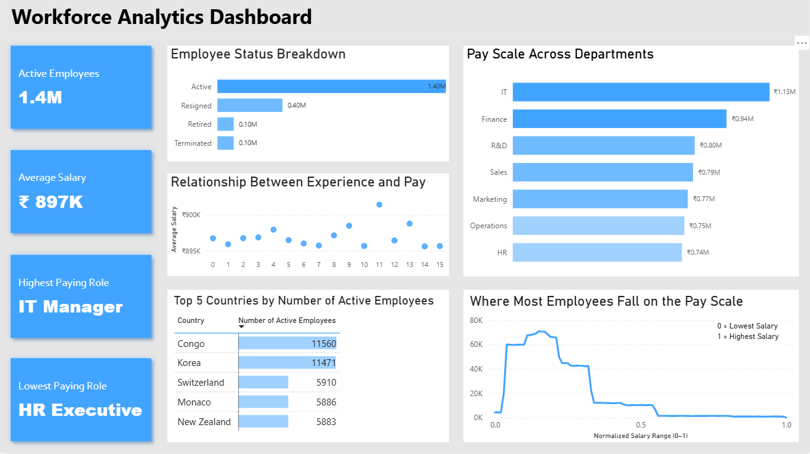
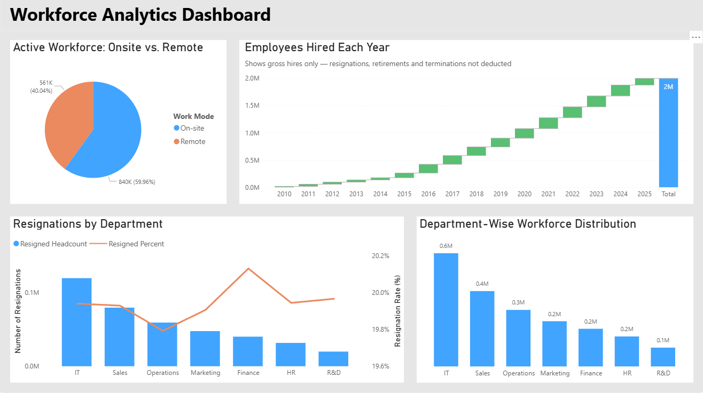

# Workforce Analytics Dashboard (Power BI)

Interactive HR analytics dashboard built in **Power BI** to explore workforce composition, compensation patterns, hiring trends, and attrition signals for a multinational company dataset (~2M records). The report uses **Power Query** for data prep and **DAX** for measures to support fast, slice-and-dice analysis.

## Dashboard Preview

## Case Study (visual write-up)

https://krrusha.github.io/MNC-HR-Data-Analysis/

> Note: The full interactive Power BI report is in `Workforce_Analytics_Dashboard.pbix` in this repo.

## What This Dashboard Covers

- **Workforce overview:** active headcount, employee status breakdown, and work mode (on-site vs. remote)
- **Department insights:** workforce distribution, average pay by department, and department-level resignations
- **Compensation patterns:** pay scale distribution and highest/lowest paying roles
- **Experience vs pay:** how salary changes across years of experience
- **Geography:** countries with the highest concentration of active employees
- **Hiring trend:** hires by year (gross hires)

## Tools Used

- **Power BI**
- **Power Query** (data cleaning & transformation)
- **DAX** (measures / calculated columns)
- **Data modeling** (relationships + report-ready structure)

## Data Source

Kaggle — HR Data (MNC)  
https://www.kaggle.com/datasets/rohitgrewal/hr-data-mnc

> This dataset contains HR information for employees of a multinational corporation (MNC). It includes 2 million employee records with details about personal identifiers, job-related attributes, performance, employment status and salary information.

